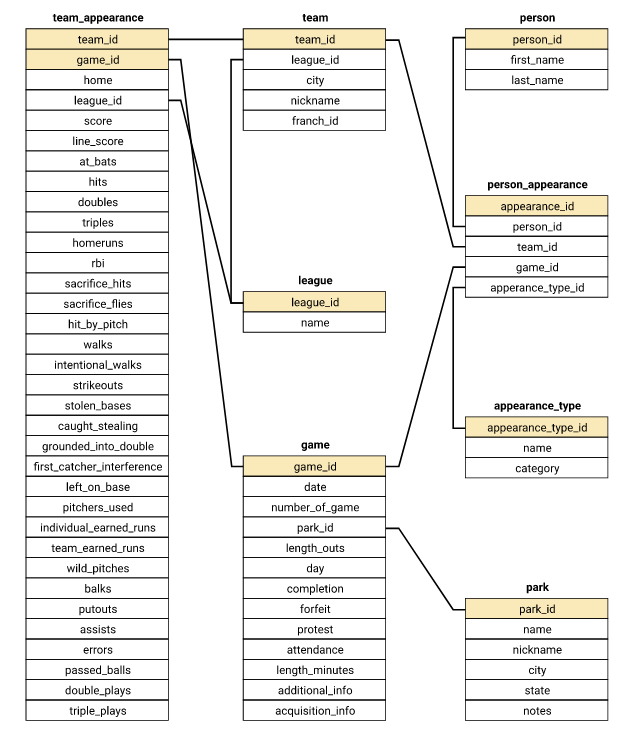

```{r setup, include=FALSE}
knitr::opts_chunk$set(echo = TRUE)
```
```{r}
library(tidyverse)
library(RSQLite)
library(DBI)
```

# Exploring data
```{r}

game <- read_csv("game_log.csv")
park <- read_csv("park_codes.csv")
person <- read_csv("person_codes.csv")
team <- read_csv("team_codes.csv")

```

`game` dataset includes every game from 1871 till 2016 and every detail of the game.
`park` dataset includes information from every park, identified by id and name.
`person` includes information from every player
`team` includes information from every team, identifies by team id.

# Importing Data Into SQLite
```{r}
conn <- dbConnect(SQLite(), "mlb.db")
dbWriteTable(conn = conn, name = "game_log", 
             value = game, row.names = FALSE, header = TRUE)
dbWriteTable(conn = conn, name = "person_codes", 
             value = person, row.names = FALSE, header = TRUE)
dbWriteTable(conn = conn, name = "team_codes", 
             value = team, row.names = FALSE, header = TRUE)
dbWriteTable(conn = conn, name = "park_codes", 
             value = park, row.names = FALSE, header = TRUE)

dbListTables(conn)

```
# Create game_id for game_log table

```{r}
add_gameid_col <- '
ALTER TABLE game_log
ADD COLUMN game_id TEXT;
'

dbExecute(conn, add_gameid_col)

# Check column exist
q <- 'SELECT game_id FROM game_log LIMIT 3'
dbGetQuery(conn, q)

```
```{r}
# update game_id column

update_gameid <- '
UPDATE game_log
SET game_id = CAST(date AS INTEGER) || h_name || CAST(number_of_game AS INTEGER)
WHERE game_id is NULL;
'

dbExecute(conn, update_gameid)

# Check column
q <- '
  SELECT
      game_id,
      date,
      h_name,
      number_of_game
  FROM game_log
  LIMIT 5;
  '
dbGetQuery(conn, q)

```

# Looking for opportunities to normalize tables

* In person_codes, all the debut dates are in game_log.
* In team_codes, the start, end and sequence columns are in game_log.
* In park_codes, the start and end years are in game_log. 
* In game_log we have players_name. They are also in person_codes.
* In game_log, all offensive and defensive stats are repeated for the home team and the visiting team. We could break these out and have a table that lists each game twice, one for each team, and cut out this column repetition.
* Similarly, in game_log, we have a listing for 9 players on each team with their positions - we can remove these and have one table that tracks player appearances and their positions.
* We can do a similar thing with the umpires from game_log, instead of listing all four positions as columns, we can put the umpires either in their own table or make one table for players, umpires and managers.
* We have several awards in game_log like winning pitcher and losing pitcher. We can either break these out into their own table, have a table for awards, or combine the awards in with general appearances like the players and umpires.


# Create person table

```{r}
create_person <- '
CREATE TABLE IF NOT EXISTS person (
  person_id TEXT PRIMARY KEY,
  first_name TEXT,
  last_name TEXT
);
'

dbExecute(conn, create_person)
```

```{r}
insert_to_person <- '
INSERT OR IGNORE INTO person
SELECT
  id,
  first,
  last
FROM person_codes;
'

dbExecute(conn, insert_to_person)
```
```{r}
# Check if person table is OK

check_query <- "SELECT * FROM person LIMIT 5;"

check <- dbGetQuery(conn, check_query)

check
```
# Create park table
```{r}
park_table <- '
  CREATE TABLE IF NOT EXISTS park (
    park_id TEXT PRIMARY KEY,
    name TEXT,
    nickname TEXT,
    city TEXT,
    state TEXT,
    notes TEXT
  );
'

dbExecute(conn, park_table)
```
```{r}
park_info <- '
INSERT OR IGNORE INTO park
SELECT
    park_id,
    name,
    aka,
    city,
    state,
    notes
FROM park_codes;
'

dbExecute(conn, park_info)
```
```{r}
cq <- "SELECT * FROM park LIMIT 5;"

check2 <- dbGetQuery(conn, cq)

check2
```
# Create league table
```{r}
league_table <- '
CREATE TABLE IF NOT EXISTS league(
  league_id TEXT PRIMARY KEY,
  name TEXT
);
'
dbExecute(conn, league_table)

league_info <- '
INSERT OR IGNORE INTO league
VALUES
      ("NL", "National League"),
      ("AL", "American League"),
      ("AA", "American Association"),
      ("FL", "Federal League"),
      ("PL", "Players League"),
      ("UA", "Union Association");
'

dbExecute(conn, league_info)

cq2 <- 'SELECT * FROM league LIMIT 5'

dbGetQuery(conn, cq2)
```
# Create appearance_type table from appearance_type.csv

```{r}
# Elimina la tabla si existe
appearance_drop_precaution <- "DROP TABLE IF EXISTS appearance_type;"
dbExecute(conn, appearance_drop_precaution)

appearance_type = read_csv('appearance_type.csv')
dbWriteTable(conn = conn, name = "appearance_type", value = "appearance_type.csv", row.names = FALSE, header = TRUE)

cq_3 <- 'SELECT * FROM appearance_type LIMIT 5;'
dbGetQuery(conn, cq_3)

```

# Creating team table
```{r}
# The start, end, and sequence columns can be derived from the game level data.

team_table <- "
CREATE TABLE IF NOT EXISTS team (
  team_id TEXT PRIMARY KEY,
  league_id TEXT,
  city TEXT,
  nickname TEXT,
  franch_id TEXT,
  FOREIGN KEY (league_id) REFERENCES league(league_id)
);
"

dbExecute(conn, team_table)

team_info <- "
  INSERT OR IGNORE INTO team
  SELECT
      team_id,
      league,
      city,
      nickname,
      franch_id
  FROM team_codes;
"

dbExecute(conn, team_info)

cq4 <- "SELECT * FROM team LIMIT 5;"

dbGetQuery(conn, cq4)


```
# Creating game table

Considerations:

* Included all columns for the game_log that don't refer to one specific team or player, instead putting those in two appearance tables.

* Removed the column with the day of the week, as this can be derived from the date.

* Changed the day_night column to day (boolean column)

```{r}
game_table <- "
  CREATE TABLE IF NOT EXISTS game (
      game_id TEXT PRIMARY KEY,
      date TEXT,
      number_of_game INTEGER,
      park_id TEXT,
      length_outs INTEGER,
      day BOOLEAN,
      completion TEXT,
      forefeit TEXT,
      protest TEXT,
      attendance INTEGER,
      legnth_minutes INTEGER,
      additional_info TEXT,
      acquisition_info TEXT,
      FOREIGN KEY (park_id) REFERENCES park(park_id)
  );
"

dbExecute(conn, game_table)

game_info <- '
INSERT OR IGNORE INTO game
  SELECT
      game_id,
      date,
      number_of_game,
      park_id,
      length_outs,
      CASE
          WHEN day_night = "D" THEN 1
          WHEN day_night = "N" THEN 0
          ELSE NULL
          END
          AS day,
      completion,
      forefeit,
      protest,
      attendance,
      length_minutes,
      additional_info,
      acquisition_info
  FROM game_log;
'

dbExecute(conn, game_info)

cq5 <- "SELECT * FROM game LIMIT 5;"

dbGetQuery(conn, cq5)
```
# Create team_appearance table
```{r}
team_app_table <- "
  CREATE TABLE IF NOT EXISTS team_appearance (
      team_id TEXT,
      game_id TEXT,
      home BOOLEAN,
      league_id TEXT,
      score INTEGER,
      line_score TEXT,
      at_bats INTEGER,
      hits INTEGER,
      doubles INTEGER,
      triples INTEGER,
      homeruns INTEGER,
      rbi INTEGER,
      sacrifice_hits INTEGER,
      sacrifice_flies INTEGER,
      hit_by_pitch INTEGER,
      walks INTEGER,
      intentional_walks INTEGER,
      strikeouts INTEGER,
      stolen_bases INTEGER,
      caught_stealing INTEGER,
      grounded_into_double INTEGER,
      first_catcher_interference INTEGER,
      left_on_base INTEGER,
      pitchers_used INTEGER,
      individual_earned_runs INTEGER,
      team_earned_runs INTEGER,
      wild_pitches INTEGER,
      balks INTEGER,
      putouts INTEGER,
      assists INTEGER,
      errors INTEGER,
      passed_balls INTEGER,
      double_plays INTEGER,
      triple_plays INTEGER,
      PRIMARY KEY (team_id, game_id),
      FOREIGN KEY (team_id) REFERENCES team(team_id),
      FOREIGN KEY (game_id) REFERENCES game(game_id),
      FOREIGN KEY (team_id) REFERENCES team(team_id)
  );
"
dbExecute(conn, team_app_table)
```
```{r}
team_app_info <- '
  INSERT OR IGNORE INTO team_appearance
      SELECT
          h_name,
          game_id,
          1 AS home,
          h_league,
          h_score,
          h_line_score,
          h_at_bats,
          h_hits,
          h_doubles,
          h_triples,
          h_homeruns,
          h_rbi,
          h_sacrifice_hits,
          h_sacrifice_flies,
          h_hit_by_pitch,
          h_walks,
          h_intentional_walks,
          h_strikeouts,
          h_stolen_bases,
          h_caught_stealing,
          h_grounded_into_double,
          h_first_catcher_interference,
          h_left_on_base,
          h_pitchers_used,
          h_individual_earned_runs,
          h_team_earned_runs,
          h_wild_pitches,
          h_balks,
          h_putouts,
          h_assists,
          h_errors,
          h_passed_balls,
          h_double_plays,
          h_triple_plays
      FROM game_log
  
  UNION
  
      SELECT    
          v_name,
          game_id,
          0 AS home,
          v_league,
          v_score,
          v_line_score,
          v_at_bats,
          v_hits,
          v_doubles,
          v_triples,
          v_homeruns,
          v_rbi,
          v_sacrifice_hits,
          v_sacrifice_flies,
          v_hit_by_pitch,
          v_walks,
          v_intentional_walks,
          v_strikeouts,
          v_stolen_bases,
          v_caught_stealing,
          v_grounded_into_double,
          v_first_catcher_interference,
          v_left_on_base,
          v_pitchers_used,
          v_individual_earned_runs,
          v_team_earned_runs,
          v_wild_pitches,
          v_balks,
          v_putouts,
          v_assists,
          v_errors,
          v_passed_balls,
          v_double_plays,
          v_triple_plays
      from game_log;
'

dbExecute(conn, team_app_info)

```

```{r}
cq6 <- "
SELECT * 
FROM team_appearance 
ORDER By game_id, home 
LIMIT 5;
"

dbGetQuery(conn, cq6)

```
# Creating person_appearance
Used to store appearances in games by managers, players, and umpires.

```{r}

drop_person_appearance_precaution <- "DROP TABLE IF EXISTS person_appearance"
dbExecute(conn, drop_person_appearance_precaution)

person_app_table <- "
  CREATE TABLE person_appearance (
      appearance_id INTEGER PRIMARY KEY,
      person_id TEXT,
      team_id TEXT,
      game_id TEXT,
      appearance_type_id,
      FOREIGN KEY (person_id) REFERENCES person(person_id),
      FOREIGN KEY (team_id) REFERENCES team(team_id),
      FOREIGN KEY (game_id) REFERENCES game(game_id),
      FOREIGN KEY (appearance_type_id) REFERENCES appearance_type(appearance_type_id)
  );
"

dbExecute(conn, person_app_table)

```
```{r}
person_app_info <- '
  INSERT OR IGNORE INTO person_appearance (
      game_id,
      team_id,
      person_id,
      appearance_type_id
  ) 
      SELECT
          game_id,
          NULL,
          hp_umpire_id,
          "UHP"
      FROM game_log
      WHERE hp_umpire_id IS NOT NULL    
  
  UNION
  
      SELECT
          game_id,
          NULL,
          [1b_umpire_id],
          "U1B"
      FROM game_log
      WHERE "1b_umpire_id" IS NOT NULL
  
  UNION
  
      SELECT
          game_id,
          NULL,
          [2b_umpire_id],
          "U2B"
      FROM game_log
      WHERE [2b_umpire_id] IS NOT NULL
  
  UNION
  
      SELECT
          game_id,
          NULL,
          [3b_umpire_id],
          "U3B"
      FROM game_log
      WHERE [3b_umpire_id] IS NOT NULL
  
  UNION
  
      SELECT
          game_id,
          NULL,
          lf_umpire_id,
          "ULF"
      FROM game_log
      WHERE lf_umpire_id IS NOT NULL
  
  UNION
  
      SELECT
          game_id,
          NULL,
          rf_umpire_id,
          "URF"
      FROM game_log
      WHERE rf_umpire_id IS NOT NULL
  
  UNION
  
      SELECT
          game_id,
          v_name,
          v_manager_id,
          "MM"
      FROM game_log
      WHERE v_manager_id IS NOT NULL
  
  UNION
  
      SELECT
          game_id,
          h_name,
          h_manager_id,
          "MM"
      FROM game_log
      WHERE h_manager_id IS NOT NULL
  
  UNION
  
      SELECT
          game_id,
          CASE
              WHEN h_score > v_score THEN h_name
              ELSE v_name
              END,
          winning_pitcher_id,
          "AWP"
      FROM game_log
      WHERE winning_pitcher_id IS NOT NULL
  
  UNION
  
      SELECT
          game_id,
          CASE
              WHEN h_score < v_score THEN h_name
              ELSE v_name
              END,
          losing_pitcher_id,
          "ALP"
      FROM game_log
      WHERE losing_pitcher_id IS NOT NULL
  
  UNION
  
      SELECT
          game_id,
          CASE
              WHEN h_score > v_score THEN h_name
              ELSE v_name
              END,
          saving_pitcher_id,
          "ASP"
      FROM game_log
      WHERE saving_pitcher_id IS NOT NULL
  
  UNION
  
      SELECT
          game_id,
          CASE
              WHEN h_score > v_score THEN h_name
              ELSE v_name
              END,
          winning_rbi_batter_id,
          "AWB"
      FROM game_log
      WHERE winning_rbi_batter_id IS NOT NULL
  
  UNION
  
      SELECT
          game_id,
          v_name,
          v_starting_pitcher_id,
          "PSP"
      FROM game_log
      WHERE v_starting_pitcher_id IS NOT NULL
  
  UNION
  
      SELECT
          game_id,
          h_name,
          h_starting_pitcher_id,
          "PSP"
      FROM game_log
      WHERE h_starting_pitcher_id IS NOT NULL;

'

dbExecute(conn, person_app_info)
```
```{r}
for (letter in c("h", "v")) {
  for (num in 1:9) {
    template <- '
      INSERT INTO person_appearance (
          game_id,
          team_id,
          person_id,
          appearance_type_id
      ) 
          SELECT
              game_id,
              %s_name,
              %s_player_%f_id,
              "O%f"
          FROM game_log
          WHERE %s_player_%f_id IS NOT NULL
      
      UNION
      
          SELECT
              game_id,
              %s_name,
              %s_player_%f_id,
              "D" || CAST(%s_player_%f_def_pos AS INT)
          FROM game_log
          WHERE %s_player_%f_id IS NOT NULL;
    '
    # replace all of the %s and %f with the correct letter number
    template <- gsub("%s", letter, template, fixed = TRUE)
    template <- gsub("%f", num, template, fixed = TRUE)
    
    dbExecute(conn, template)
  }
}

```

# Removing the Original Tables
```{r}
# Check tables in mld.db

dbListTables(conn)
```
```{r}
original_tables <- c("game_log",
                      "park_codes",
                     "team_codes",
                     "person_codes")


# %s = character string substituted by table
for (table in original_tables){
  drop_command = sprintf("DROP TABLE %s", table)
  dbExecute(conn, drop_command)
}

# check tables in database
dbListTables(conn)
```


